This R Notebook is the complement to my blog post [Benchmarking TensorFlow on CPUs: More Cost-Effective Deep Learning than GPUs](http://minimaxir.com/2017/07/cpu-or-gpu/).

This notebook is licensed under the MIT License. If you use the code or data visualization designs contained within this notebook, it would be greatly appreciated if proper attribution is given back to this notebook and/or myself. Thanks! :)

```{r}
library(readr)
library(dplyr)
library(ggplot2)
library(scales)
library(tidyr)
library(RColorBrewer)

sessionInfo()
```

Set ggplot2 theme.

```{r}
theme_set(theme_minimal(base_size=9, base_family="Source Sans Pro") +
            theme(plot.title = element_text(size=11, family="Source Sans Pro Bold"),
                  axis.title.x = element_blank(),
                  axis.title.y = element_text(family="Source Sans Pro Semibold"),
                  plot.caption = element_text(size=6, color="#969696"),
                  axis.text.x = element_text(angle = 45, vjust = 0.75, size = 7),
                  legend.position="none"))
```

```{r}
relative <- function(x) {
  lab <- paste0(sprintf("%.2f", x), 'x')
}
```


Set colors according to Brewer palettes for consistent lightness. Ignore first color of palettes since it is too bright.

```{r}
color_gpu <- brewer.pal(5, "Reds")[5]
colors_pip <- rev(brewer.pal(5, "Blues")[-1])
colors_compiled <- rev(brewer.pal(5, "Greens")[-1])

colors_all <- c(color_gpu, colors_pip[1], colors_compiled[1], colors_pip[2], colors_compiled[2], colors_pip[3], colors_compiled[3], colors_pip[4], colors_compiled[4])
```

Set known price rates from [Google Compute Engine Pricing](https://cloud.google.com/compute/pricing).

```{r}
gpu_cost_hr <- 0.745
cpu8_cost_hr <- 0.060
skylake_premium <- 0.0607
```

Derive the remaining rates, in seconds.

```{r}
gpu_cost_s <- gpu_cost_hr / 3600
cpu8_cost_s <- (cpu8_cost_hr * (1 + skylake_premium)) / 3600
cpu16_cost_s <- cpu8_cost_s * 2
cpu32_cost_s <- cpu16_cost_s * 2
cpu64_cost_s <- cpu32_cost_s * 2

# works like a Python dict
costs <- c(gpu=gpu_cost_s, cpu8=cpu8_cost_s, cpu16=cpu16_cost_s, cpu32=cpu32_cost_s, cpu64=cpu64_cost_s)
```

# Analysis

Create a helpfer function to return the results for all permutations of a given test file name.

```{r}
tf_types <- c("cpu-compiled", "cpu-pip")
tf_platforms <- c("cpu8","cpu16","cpu32","cpu64")
labels <- c('gpu','cpu64pip', 'cpu64cmp','cpu32pip', 'cpu32cmp','cpu16pip', 'cpu16cmp','cpu8pip', 'cpu8cmp')


process_test_data <- function(file_name) {
  results <- read_csv(sprintf("../logs/gpu/%s", file_name)) %>%
              mutate(type = "gpu", platform = "gpu") %>%
              group_by(type, platform) %>%
              summarize(total_time = sum(elapsed),
                        total_cost = total_time * costs['gpu'])
  
  gpu_total_time <- results %>% pull(total_time)
  gpu_total_cost <- results %>% pull(total_cost)
  
  
  for(tf_type_i in 1:length(tf_types)) {
    tf_type <- tf_types[tf_type_i]
    for(tf_platform_i in 1:length(tf_platforms)) {
      tf_platform <- tf_platforms[tf_platform_i]
      
      temp_df <- read_csv(sprintf("../logs/%s/%s/%s", tf_type, tf_platform, file_name)) %>%
              mutate(type = tf_type, platform = tf_platform) %>%
              group_by(type, platform) %>%
              summarize(total_time = sum(elapsed),
                        total_cost = total_time * costs[tf_platform])
      
      results <- results %>% bind_rows(temp_df)
      
    }
  }
  
  # Normalize
  results <- results %>%
              mutate(total_time_norm = total_time / gpu_total_time,
                     total_cost_norm = total_cost / gpu_total_cost)
  
  # Format/Factorize labels
  
  results <- results %>%
              mutate(label = paste0(
                ifelse(platform == "gpu", '', platform),
                ifelse(type == "cpu-compiled", "cmp", substr(type, nchar(type)-2, nchar(type))))) %>%
              ungroup() %>%
              mutate(label= factor(label, levels=labels)) %>%
              select(label, total_time, total_cost, total_time_norm, total_cost_norm)
  
  return(results)
  
}

process_test_data('cifar10_cnn_tensorflow.csv')
```

## IMDB Bidirectional LSTM

```{r}
df_imdb_lstm <- process_test_data("imdb_bidirectional_lstm_tensorflow.csv")

df_imdb_lstm
```

```{r}
plot <- ggplot(df_imdb_lstm, aes(x=label, y=total_time_norm, fill=label)) +
          geom_bar(stat="identity") +
          geom_hline(yintercept = 1, linetype="dashed", color="#1a1a1a") +
          scale_y_continuous(labels = relative) +
          scale_fill_manual(values = colors_all) +
          labs(title = "Training Time on CPUs w/ Bidirectional LSTMs",
               x = "Platform",
               y = "Total Model Training Time Relative to GPU",
               caption = "Max Woolf — minimaxir.com")

ggsave("dl-cpu-gpu-1.png", plot, width=4, height=3)
```

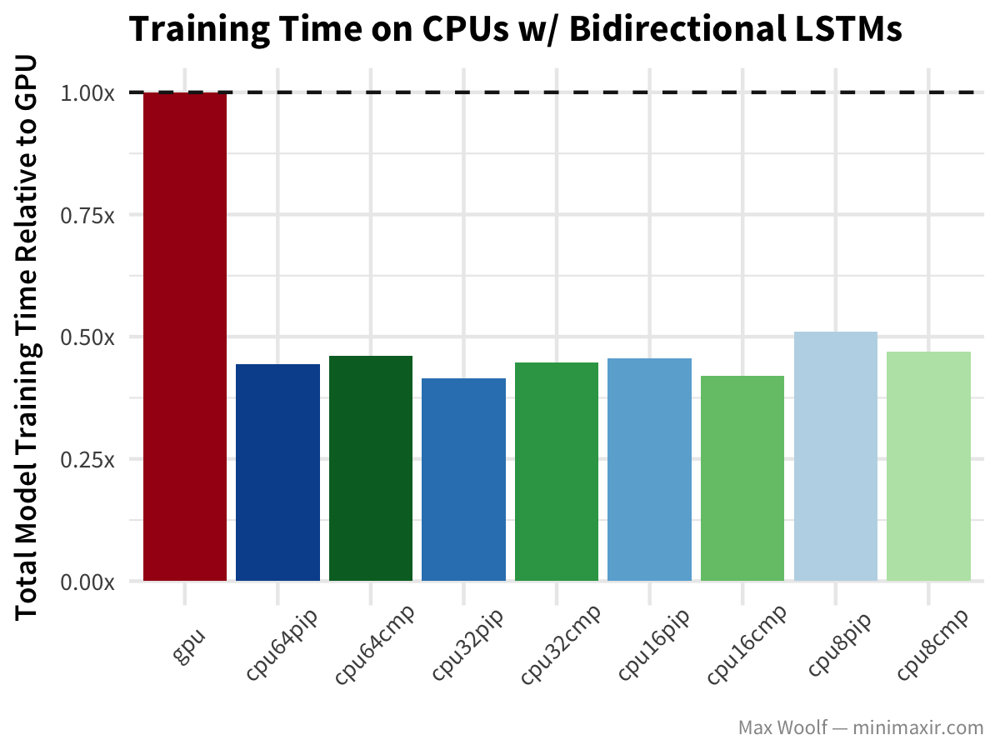

```{r}
plot <- ggplot(df_imdb_lstm, aes(x=label, y=total_cost_norm, fill=label)) +
          geom_bar(stat="identity") +
          geom_hline(yintercept = 1, linetype="dashed", color="#1a1a1a") +
          scale_y_continuous(labels = relative) +
          scale_fill_manual(values = colors_all) +
          labs(title = "Training Cost on CPUs w/ Bidirectional LSTMs",
               x = "Platform",
               y = "Total Model Training Cost Relative to GPU",
               caption = "Max Woolf — minimaxir.com")

ggsave("dl-cpu-gpu-2.png", plot, width=4, height=3)
```

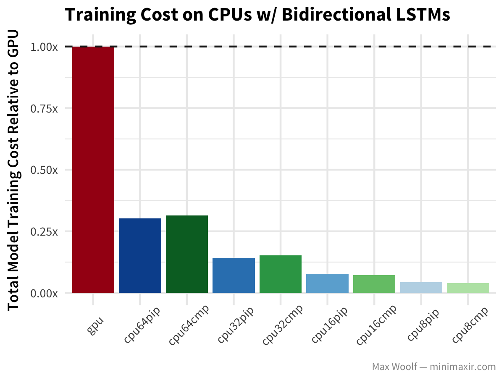

## IMDB Fasttext

```{r}
df_imdb_fasttext <- process_test_data("imdb_fasttext_tensorflow.csv")

df_imdb_fasttext
```

```{r}
plot <- ggplot(df_imdb_fasttext, aes(x=label, y=total_time_norm, fill=label)) +
          geom_bar(stat="identity") +
          geom_hline(yintercept = 1, linetype="dashed", color="#1a1a1a") +
          scale_y_continuous(labels = relative) +
          scale_fill_manual(values = colors_all) +
          labs(title = "Training Time on CPUs w/ fasttext",
               x = "Platform",
               y = "Total Model Training Time Relative to GPU",
               caption = "Max Woolf — minimaxir.com")

ggsave("dl-cpu-gpu-3.png", plot, width=4, height=3)
```


```{r}
plot <- ggplot(df_imdb_fasttext, aes(x=label, y=total_cost_norm, fill=label)) +
          geom_bar(stat="identity") +
          geom_hline(yintercept = 1, linetype="dashed", color="#1a1a1a") +
          scale_y_continuous(labels = relative) +
          scale_fill_manual(values = colors_all) +
          labs(title = "Training Cost on CPUs w/ fasttext",
               x = "Platform",
               y = "Total Model Training Cost Relative to GPU",
               caption = "Max Woolf — minimaxir.com")

ggsave("dl-cpu-gpu-4.png", plot, width=4, height=3)
```

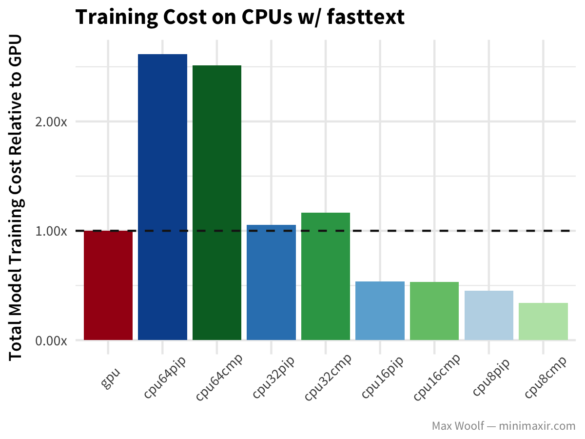

## MNIST MLP

```{r}
df_mnist_mlp <- process_test_data("mnist_mlp_tensorflow.csv")

df_mnist_mlp
```

```{r}
plot <- ggplot(df_mnist_mlp, aes(x=label, y=total_time_norm, fill=label)) +
          geom_bar(stat="identity") +
          geom_hline(yintercept = 1, linetype="dashed", color="#1a1a1a") +
          scale_y_continuous(labels = relative) +
          scale_fill_manual(values = colors_all) +
          labs(title = "Training Time on CPUs w/ MLP",
               x = "Platform",
               y = "Total Model Training Time Relative to GPU",
               caption = "Max Woolf — minimaxir.com")

ggsave("dl-cpu-gpu-5.png", plot, width=4, height=3)
```

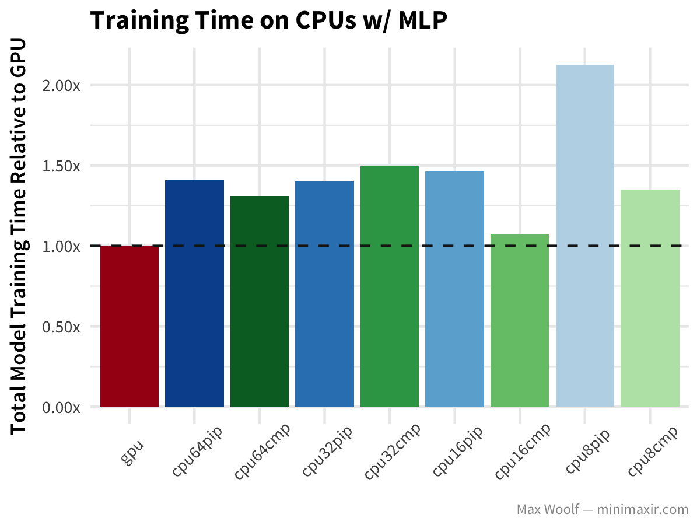

```{r}
plot <- ggplot(df_mnist_mlp, aes(x=label, y=total_cost_norm, fill=label)) +
          geom_bar(stat="identity") +
          geom_hline(yintercept = 1, linetype="dashed", color="#1a1a1a") +
          scale_y_continuous(labels = relative) +
          scale_fill_manual(values = colors_all) +
          labs(title = "Training Cost on CPUs w/ MLP",
               x = "Platform",
               y = "Total Model Training Cost Relative to GPU",
               caption = "Max Woolf — minimaxir.com")

ggsave("dl-cpu-gpu-6.png", plot, width=4, height=3)
```

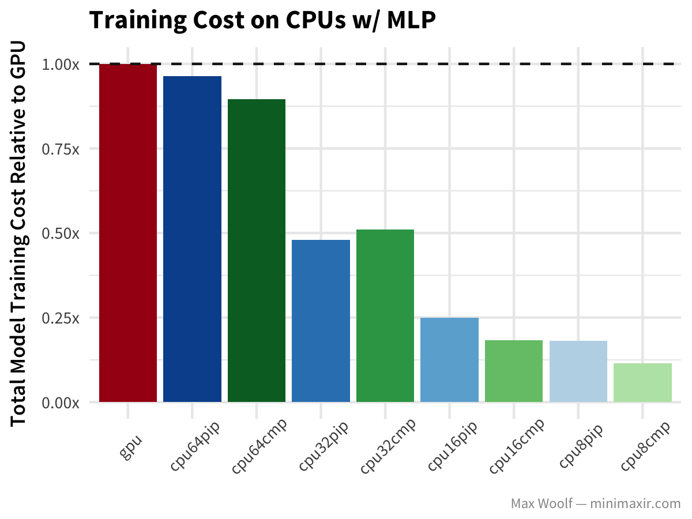

## MNIST CNN

```{r}
df_mnist_cnn <- process_test_data("mnist_cnn_tensorflow.csv")

df_mnist_cnn
```

```{r}
plot <- ggplot(df_mnist_cnn, aes(x=label, y=total_time_norm, fill=label)) +
          geom_bar(stat="identity") +
          geom_hline(yintercept = 1, linetype="dashed", color="#1a1a1a") +
          scale_y_continuous(labels = relative) +
          scale_fill_manual(values = colors_all) +
          labs(title = "Training Time on CPUs w/ CNN",
               x = "Platform",
               y = "Total Model Training Time Relative to GPU",
               caption = "Max Woolf — minimaxir.com")

ggsave("dl-cpu-gpu-7.png", plot, width=4, height=3)
```

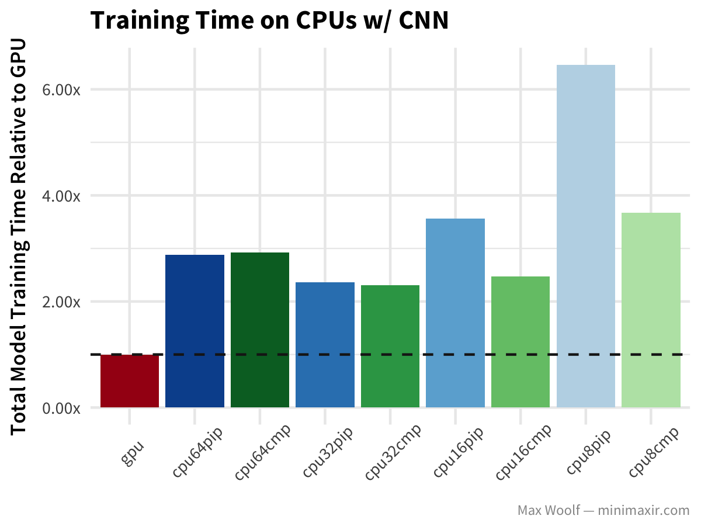

```{r}
plot <- ggplot(df_mnist_cnn, aes(x=label, y=total_cost_norm, fill=label)) +
          geom_bar(stat="identity") +
          geom_hline(yintercept = 1, linetype="dashed", color="#1a1a1a") +
          scale_y_continuous(labels = relative) +
          scale_fill_manual(values = colors_all) +
          labs(title = "Training Cost on CPUs w/ CNN",
               x = "Platform",
               y = "Total Model Training Cost Relative to GPU",
               caption = "Max Woolf — minimaxir.com")

ggsave("dl-cpu-gpu-8.png", plot, width=4, height=3)
```

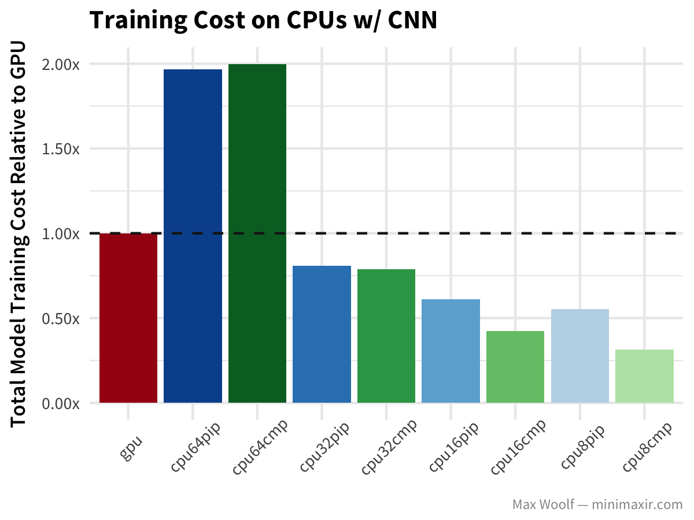

## CIFAR10 Deep CNN + MLP

```{r}
df_cifar10_cnn <- process_test_data("cifar10_cnn_tensorflow.csv")

df_cifar10_cnn
```

```{r}
plot <- ggplot(df_cifar10_cnn, aes(x=label, y=total_time_norm, fill=label)) +
          geom_bar(stat="identity") +
          geom_hline(yintercept = 1, linetype="dashed", color="#1a1a1a") +
          scale_y_continuous(labels = relative) +
          scale_fill_manual(values = colors_all) +
          labs(title = "Training Time on CPUs w/ Deep CNN + MLP",
               x = "Platform",
               y = "Total Model Training Time Relative to GPU",
               caption = "Max Woolf — minimaxir.com")

ggsave("dl-cpu-gpu-9.png", plot, width=4, height=3)
```

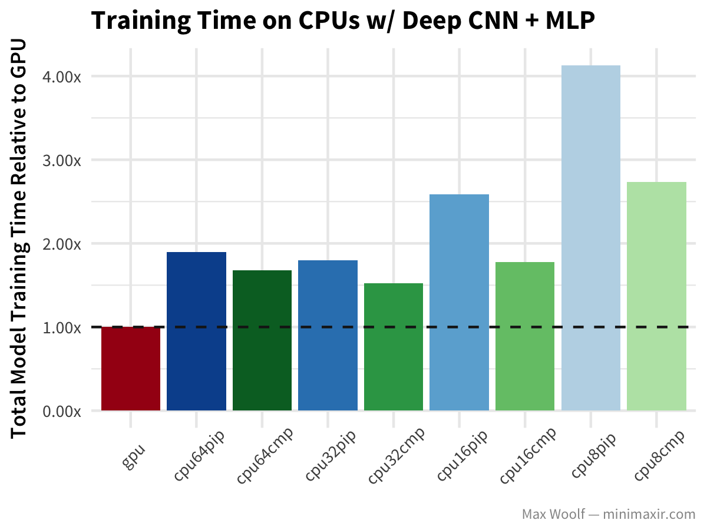

```{r}
plot <- ggplot(df_cifar10_cnn, aes(x=label, y=total_cost_norm, fill=label)) +
          geom_bar(stat="identity") +
          geom_hline(yintercept = 1, linetype="dashed", color="#1a1a1a") +
          scale_y_continuous(labels = relative) +
          scale_fill_manual(values = colors_all) +
          labs(title = "Training Cost on CPUs w/ Deep CNN + MLP",
               x = "Platform",
               y = "Total Model Training Cost Relative to GPU",
               caption = "Max Woolf — minimaxir.com")

ggsave("dl-cpu-gpu-10.png", plot, width=4, height=3)
```

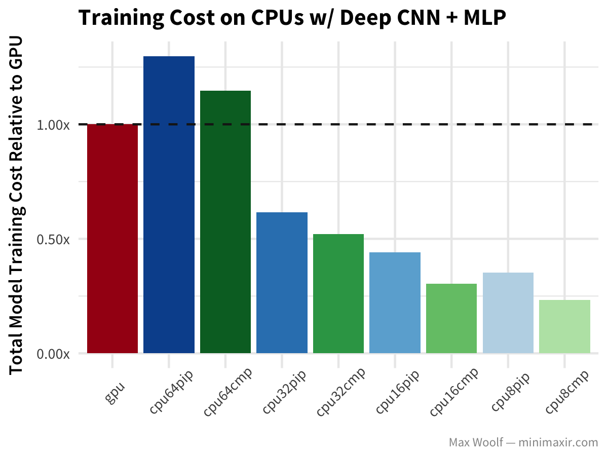

## LSTM Text Generation

```{r}
df_lstm_text <- process_test_data("lstm_text_generation_tensorflow.csv")

df_lstm_text
```

```{r}
plot <- ggplot(df_lstm_text, aes(x=label, y=total_time_norm, fill=label)) +
          geom_bar(stat="identity") +
          geom_hline(yintercept = 1, linetype="dashed", color="#1a1a1a") +
          scale_y_continuous(labels = relative) +
          scale_fill_manual(values = colors_all) +
          labs(title = "Training Time on CPUs w/ LSTM Text Gen",
               x = "Platform",
               y = "Total Model Training Time Relative to GPU",
               caption = "Max Woolf — minimaxir.com")

ggsave("dl-cpu-gpu-11.png", plot, width=4, height=3)
```

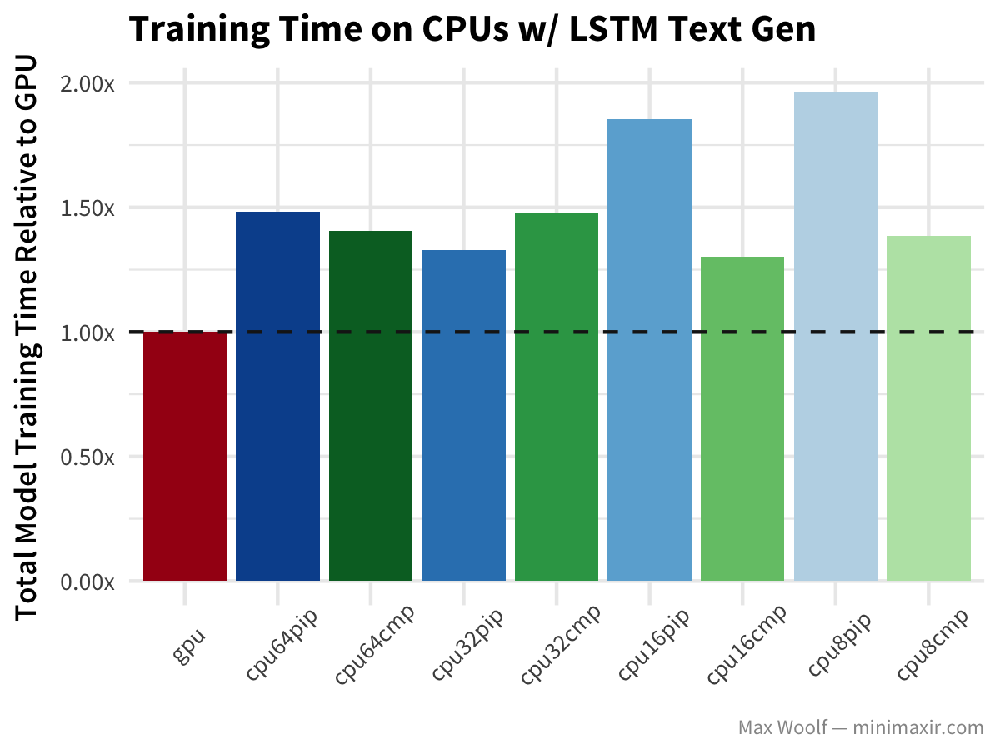

```{r}
plot <- ggplot(df_lstm_text, aes(x=label, y=total_cost_norm, fill=label)) +
          geom_bar(stat="identity") +
          geom_hline(yintercept = 1, linetype="dashed", color="#1a1a1a") +
          scale_y_continuous(labels = relative) +
          scale_fill_manual(values = colors_all) +
          labs(title = "Training Cost on CPUs w/ LSTM Text Gen",
               x = "Platform",
               y = "Total Model Training Cost Relative to GPU",
               caption = "Max Woolf — minimaxir.com")

ggsave("dl-cpu-gpu-12.png", plot, width=4, height=3)
```

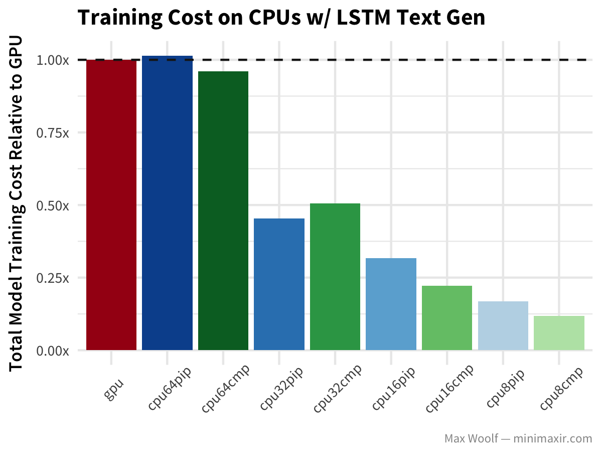

## Custom Text Generation

```{r}
df_custom_text <- process_test_data("text_generator_keras_tensorflow.csv")

df_custom_text
```

```{r}
plot <- ggplot(df_custom_text, aes(x=label, y=total_time_norm, fill=label)) +
          geom_bar(stat="identity") +
          geom_hline(yintercept = 1, linetype="dashed", color="#1a1a1a") +
          scale_y_continuous(labels = relative) +
          scale_fill_manual(values = colors_all) +
          labs(title = "Training Time on CPUs w/ Custom Text Gen",
               x = "Platform",
               y = "Total Model Training Time Relative to GPU",
               caption = "Max Woolf — minimaxir.com")

ggsave("dl-cpu-gpu-13.png", plot, width=4, height=3)
```

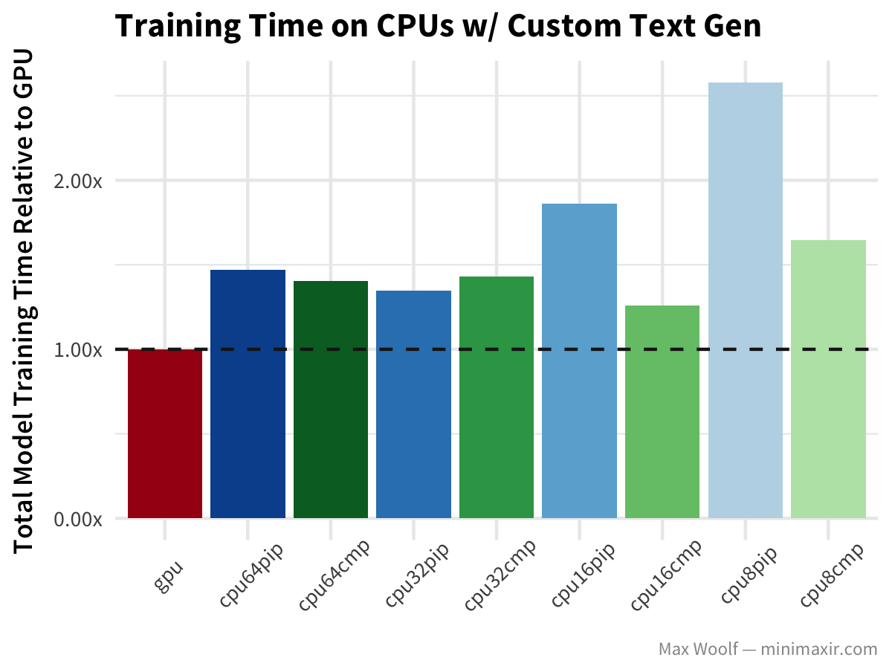

```{r}
plot <- ggplot(df_custom_text, aes(x=label, y=total_cost_norm, fill=label)) +
          geom_bar(stat="identity") +
          geom_hline(yintercept = 1, linetype="dashed", color="#1a1a1a") +
          scale_y_continuous(labels = relative) +
          scale_fill_manual(values = colors_all) +
          labs(title = "Training Cost on CPUs w/ Custom Text Gen",
               x = "Platform",
               y = "Total Model Training Cost Relative to GPU",
               caption = "Max Woolf — minimaxir.com")

ggsave("dl-cpu-gpu-14.png", plot, width=4, height=3)
```

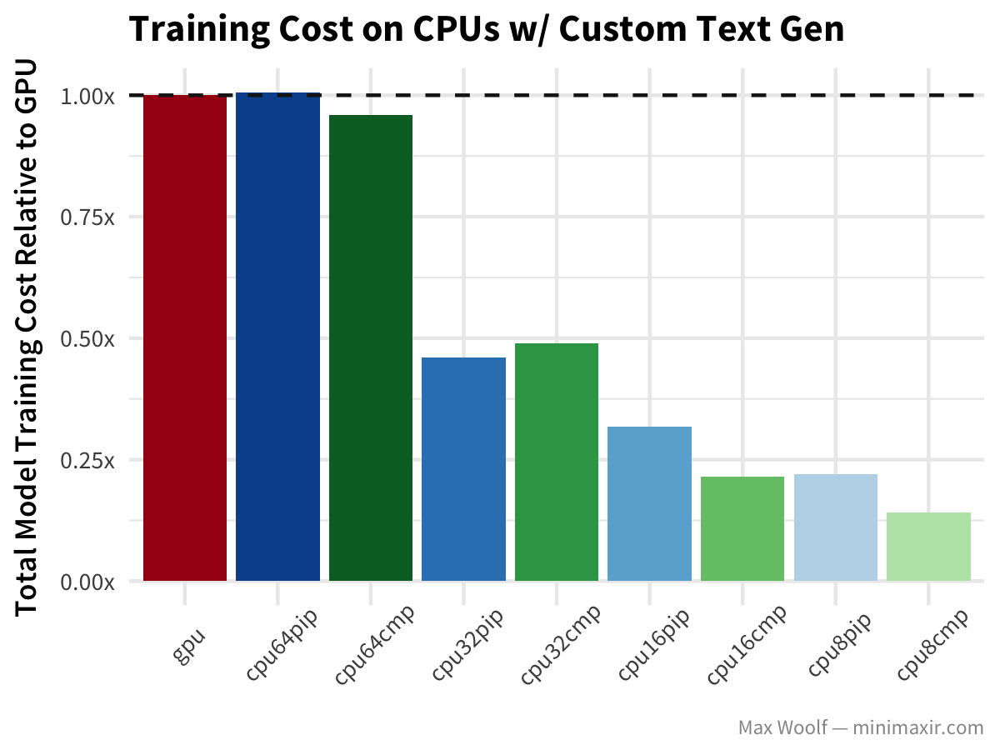

## LICENSE

MIT License

Copyright (c) 2017 Max Woolf

Permission is hereby granted, free of charge, to any person obtaining a copy
of this software and associated documentation files (the "Software"), to deal
in the Software without restriction, including without limitation the rights
to use, copy, modify, merge, publish, distribute, sublicense, and/or sell
copies of the Software, and to permit persons to whom the Software is
furnished to do so, subject to the following conditions:

The above copyright notice and this permission notice shall be included in all
copies or substantial portions of the Software.

THE SOFTWARE IS PROVIDED "AS IS", WITHOUT WARRANTY OF ANY KIND, EXPRESS OR
IMPLIED, INCLUDING BUT NOT LIMITED TO THE WARRANTIES OF MERCHANTABILITY,
FITNESS FOR A PARTICULAR PURPOSE AND NONINFRINGEMENT. IN NO EVENT SHALL THE
AUTHORS OR COPYRIGHT HOLDERS BE LIABLE FOR ANY CLAIM, DAMAGES OR OTHER
LIABILITY, WHETHER IN AN ACTION OF CONTRACT, TORT OR OTHERWISE, ARISING FROM,
OUT OF OR IN CONNECTION WITH THE SOFTWARE OR THE USE OR OTHER DEALINGS IN THE
SOFTWARE.